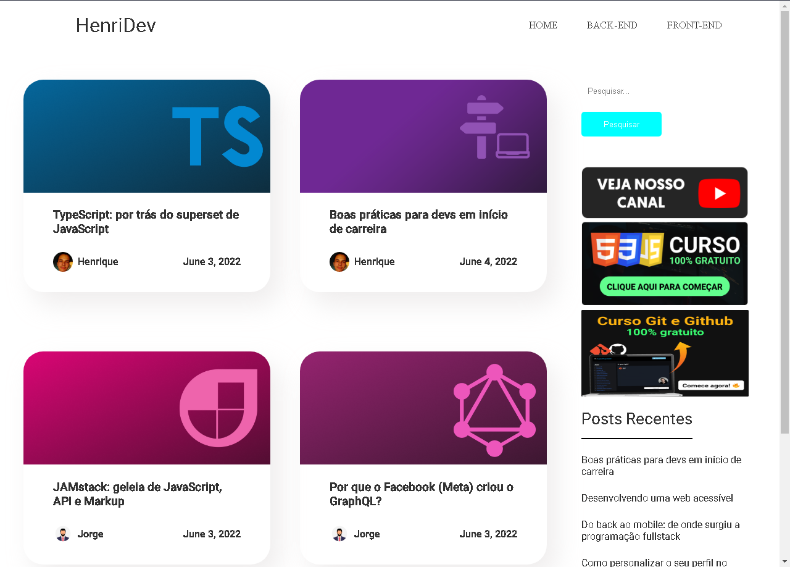
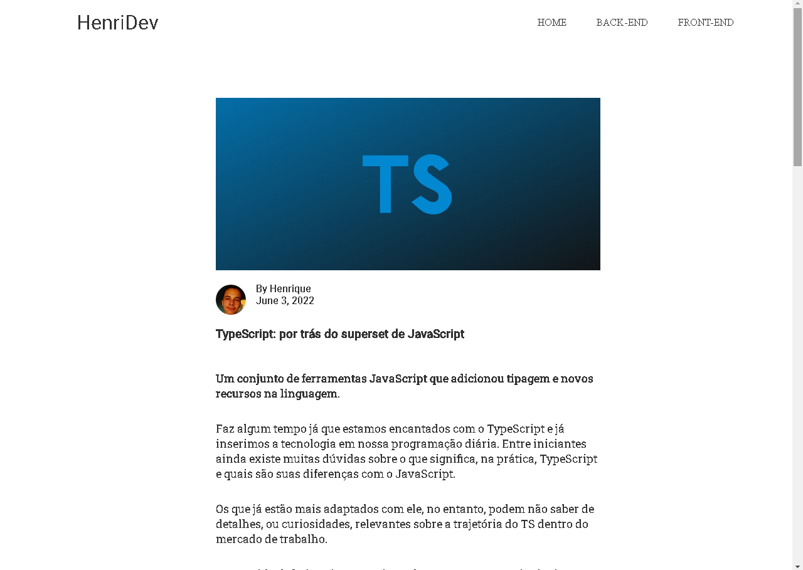

<h4 align="center"> 
    :construction:  Projeto em construção  :construction:
</h4>

<h1 align="center">HenriDev - Personal Blog</h1>

## Descrição do projeto

 Este blog será utilizado futuramente por mim para que eu publique meu ponto de vista sobre programação. O projeto não está completo, as rotas ainda não funcionam mas a aplicação já está conectada com graphcms, os artigos que aqui estão não são de minha autoria, são apenas exemplos.

## Imagens Demonstrativas

 

## 🛠️ Abrir e rodar o projeto

**Instale as dependências necessárias com: yarn** 
**Inicie o projeto com: yarn dev**

## ✔️ Tecnologias utilizadas

- `NextJs`
- `GraphQL`
- `SASS`

## Créditos

Todos os artigos foram retirados do blog da Rocketseat, usei eles como exemplo para minha aplicação 
</>

https://blog.rocketseat.com.br/

